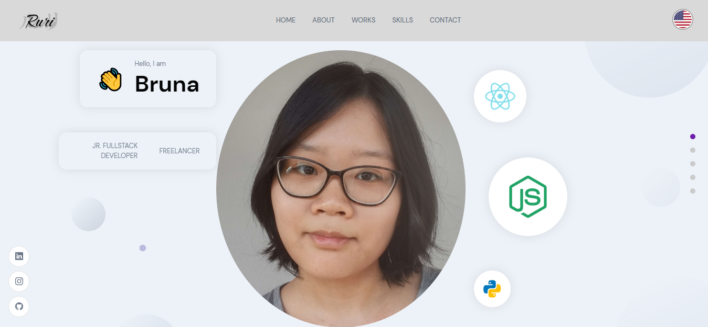

# portfolio
# About
Welcome to my portfolio! This web app is totally responsible to mobile devices and have the function to change between languages (American English and Brazilian Portuguese).
It features Sanity for the backend setup and animation between sections with framer-motion lib.
<p align="center">  </p> 
<p align="center">  </p> 

# Techs
- Javascript
- React
- Sass CSS
- Sanity
- framer-motion
- React i18next
- HOC

# Test
Clone this repo. and install all needed dependencies

```bash
npm install
```
Then run 
```bash
npm start
```
And enjoy!

